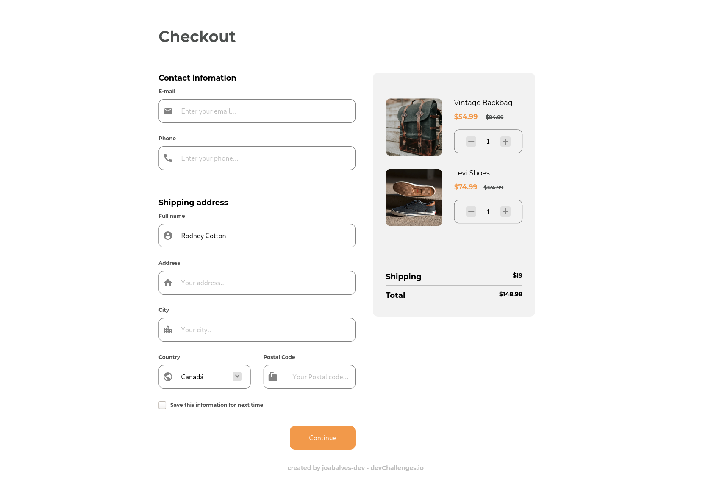
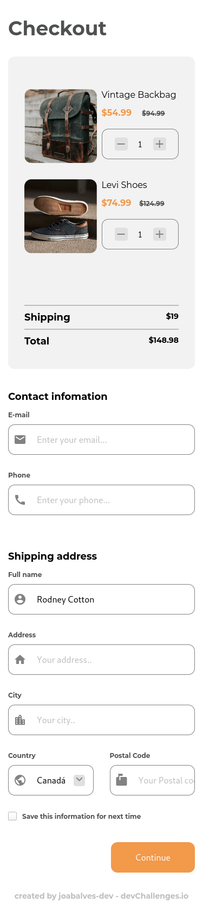

<!-- Please update value in the {}  -->

<h1 align="center">Checkout Page</h1>

<div align="center">
   Solution for a challenge from  <a href="http://devchallenges.io" target="_blank">Devchallenges.io</a>.
</div>

<div align="center">
  <h3>
    <a href="https://devs.natal.br/devchallenges/checkout-page-master">
      Demo
    </a>
    <span> | </span>
    <a href="https://github.com/joabalves-dev/challenges-checkout-page">
      Solution
    </a>
    <span> | </span>
    <a href="https://devchallenges.io/challenges/0J1NxxGhOUYVqihwegfO">
      Challenge
    </a>
  </h3>
</div>

<!-- TABLE OF CONTENTS -->

## Table of Contents

- [Overview](#overview)
  - [Built With](#built-with)
- [Features](#features)
- [Contact](#contact)
- [Acknowledgements](#acknowledgements)

<!-- OVERVIEW -->

## Overview





<!-- This section should list any major frameworks that you built your project using. Here are a few examples.-->

- [Html5](https://)
- [Css3](https://)
- [javaScript](https://)


## How To Use

To clone and run this application, you'll need [Git](https://git-scm.com). From your command line:

```bash
# Clone this repository
$ git clone https://github.com/joabalves-dev/challenges-checkout-page
```
## Contact

- Website [devs.natal.br](https://devs.natal.br)
- GitHub [@joabalves-dev](https://github.com/joabalves-dev)
